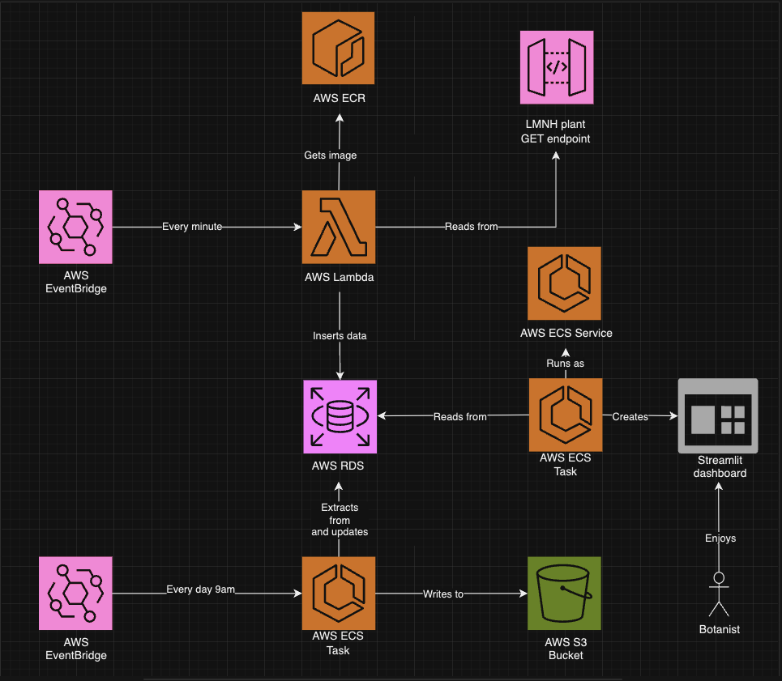
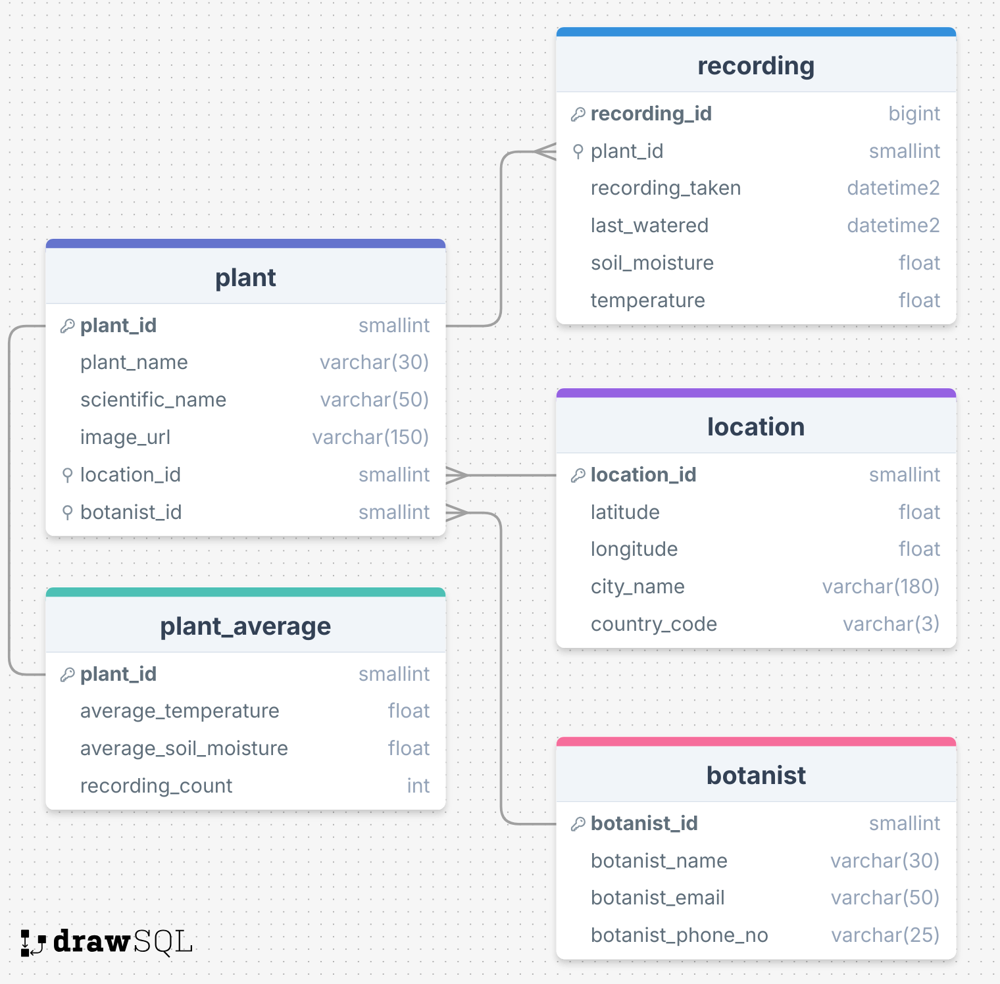
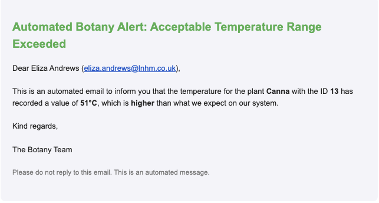
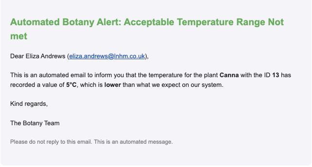
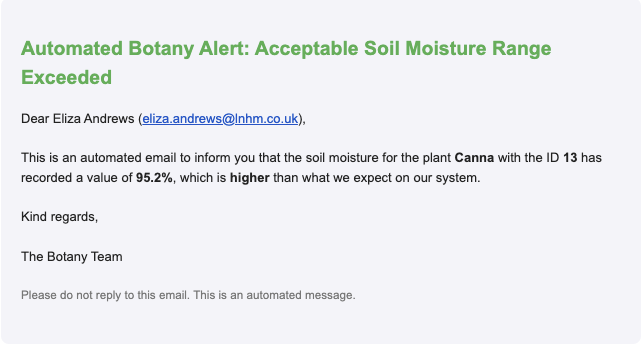
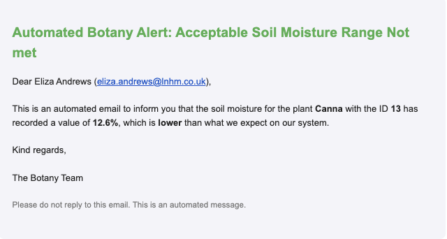
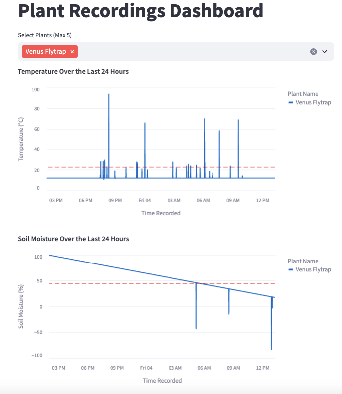
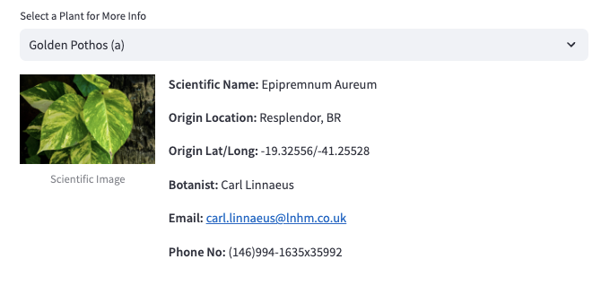

# LMNH Botanical Garden Project

## Overview

The Liverpool Natural History Museum has recently opened a botanical garden wing that houses a variety of plants from around the world. Each plant has a corresponding sensor that monitors the health of the plant and uploads to an API endpoint. As it stands, nothing is being done with the data being sent to the API endpoints, so we propose the following: a full data pipeline hosted in the cloud, a short term database solution that can store the data for the past 24 hours, a long term storage solution for all data older than 24 hours, and lastly a dashboard to visualise the data. With these solutions implemented, the stakeholders will be able to view up to date information on each plant and their current/recent health, as well as see data on the plants from the long term storage solution. This will enable the stakeholders to more easily make decisions to benefit the plants.

## Project Objectives

To make effective use of the sensor data, we propose the following solutions:

1. **Data Pipeline**: A cloud-hosted data pipeline to manage and process incoming data.
2. **Short-Term and Long-Term Storage**: Solutions for storing data for real-time updated and historical analysis.
3. **Data Visualisation Dashboard**: A dashboard to display plant health information to stakeholders.

With the described functionality, the LMNH will be able to monitor the health of plants and make informed decisions for the wellbeing of individual plants.
  

#### Figure 1: LMNH Botanical Garden Data Architecture

## Repository Structure

Below is a high-level description of the key components within each directory of this repository.
 
**Exact details on how to run scripts from each directory can be found in dedicated directory READMEs.**

### 1. `pipeline/`

**Description**: This directory contains the data pipeline code responsible for processing sensor data. 
The scripts within this directory named below are run chronologically as listed.

- **Files**:
  - `extract.py`: Takes plant data from the provided LMNH plant API with multi-threading and returns a DataFrame.
  - `transform.py`: Takes in the DataFrame from extract.py, returning a formatted DataFrame controlled for types.
  - `load.py`: Connects to the LMNH botanical MS SQL Server database, and commits the transformed DataFrame to the 'recording' Table.
    #### Figure 2: ERD Diagram, illustrating the structure of our database storing plant data in 3NF. 
    
  
      
  - `emailing.py`: Automatically sends an alert email to the botanist if a plant's temperature or soil moisture levels found in the committed plant data are outside the acceptable range. Emails will outline an anomaly for a given plant recording, whether an upper or lower bound has been breached, what the plant ID is, and the botanist in charge of it.
      
    Example anomaly emails for upper and lower plant temperature boundary conditions:

    
    
      
    Example anomaly emails for upper and lower plant soil moisture boundary conditions:

    
    

      
### 2. `seeding/`

**Description**:

- **Files**:
  - `connect.sh`: Connects to the remote RDS instance, where LMNH's plant data is being stored and constantly updated.
  - `schema.sql`: Defines the structure of all tables in the RDS, following the ERD and seeding the mapping tables 'plant', 'botanist' and 'location'. 
  - `reset.sh`: Uses the above 'schema.sql' script to first drop all tables, and then re-create all tables and re-insert seed data.

      
  ### 3. `terraform/`

**Description**:

- **Files**:
  - `main.tf`:
  - `variables.tf`: 
  - `schema.sql`: 

      
  ### 4. `visualisation/`

**Description**:

- **Files**:
  - `dashboard.py`:

      

    