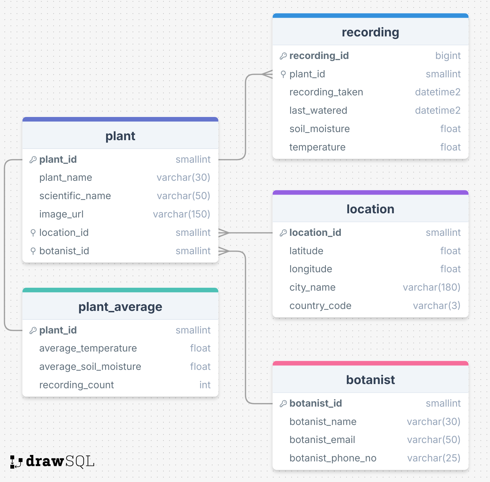

# Seeding

This directory contains the schema SQL and two bash scripts to connect to and reset the database respectively.

## Files

- `schema.sql`
    - This has all the SQL to create the initial tables and seed all the static data on plants, botanists, and locations

- `connect.sh`
    - This short shell script allows for easy connection to the database hosted on AWS RDS.

- `reset.sh`
    - This short shell script allow for the database hosted on AWS RDS to be reset according to the SQL in the `schema.sql` file.

## Usage

1. Ensure you have an `.env` file inside the [pipeline directory](../pipeline).
2. Inside the `.env`, make sure you have the following:

```
DB_HOST=x
DB_PORT=x
DB_NAME=x
DB_USER=x
DB_PASSWORD=x
```

3. Open the terminal and enter:
    - `bash connect.sh` to start an interactive session with the AWS RDS.
    - `bash reset.sh` to reset the database with the `schema.sql` file.

## ERD

This image shows the entity relationship diagram for the database created in `schema.sql`

